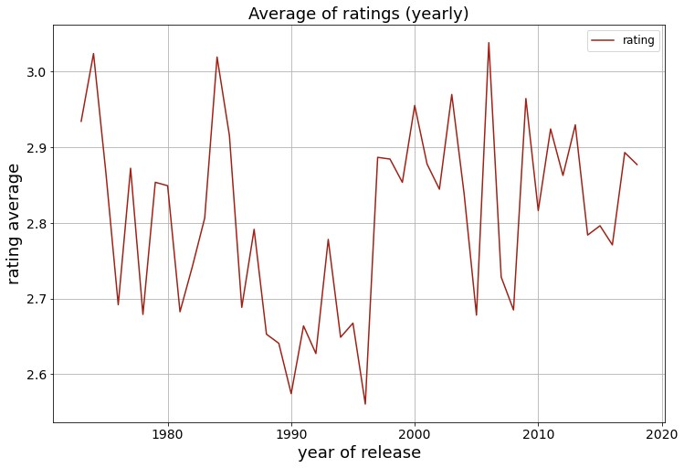
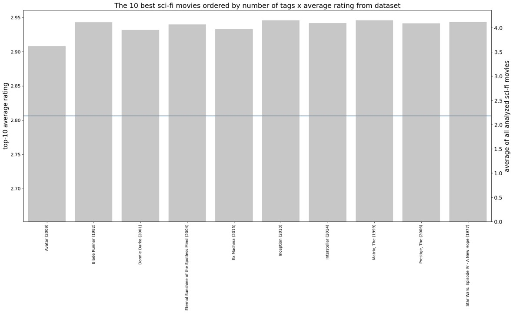

# Evolução de efeitos especiais computacionais e seu impacto na qualidade de filmes de ficção científica
## *CGI evolution and its impact in the quality of sci-fi movies*
<h2>Introdução</h2>

A ficção científica sempre levou o público aos limites da imaginação explorando novos planetas, universos e viagens no tempo. Uma das muitas maneiras de mergulhar o espectador na história é criando um mundo/ambiente imersivo com a ajuda de efeitos especiais. Inicialmente, tratava-se de um processo caro e demorado, pois dependia muito de efeitos especiais práticos para retratar um mundo fantástico e, ao mesmo tempo, realista. No entanto, com o desenvolvimento e aumento do uso de efeitos especiais computacionais (CGI), surgiram novas possibilidades na indústria cinematográfica. Dito isso, a qualidade da ficção científica melhorou com a intensificação do CGI?

<i><h2>Introduction</h2></i>

<i>
Science fiction has always taken the audience to the edge of imagination by exploring new planets, universes and time travelling. One of the many ways to immerse the viewer in the story is by creating a credible world with the help of special effects. Initially, it was an expensive and time-consuming process as it was heavily dependent on practical special effects to portray a fantastic and yet realistic world. However with the development and increasing usage of CGI in special effects new possibilities emerged in the film industry. That said, has sci-fi quality improved with the intensification of CGI?
</i>

<h2>Objetivo do projeto</h2>

O projeto tem como objetivo responder a três perguntas principais

    <ul>
        <li>O número de filmes de ficção científica aumentou ao longo dos anos?</li>
        <li>A nota média dos filmes de ficção científica aumentou com o a melhoria de efeitos especiais computacionais no decorrer dos anos?</li>
        <li>Quais são os 10 filmes com maior nota?</li>
    </ul>
 
 De uma perspectiva técnica o projeto visa ralizar um ETL estruturado e avançar em visualização de dados com ênfase na formatação dos gráficos com a biblioteca seaborn

<i>
    <h2>Project objective</h2>
    
This project aims to answer three main questions

        <ul>
            <li>Has the number of sci-fi movies increased acrooss the years?</li>
            <li>Has the average ratings of sci-fi movies got higher with the development and improvement of CGI across the years?</li>
            <li>What are the top 10 highest-rated movies?</ul>
        </ul>
    
From a technical perspective, the project aims to perform structured ETL and advance in data visualization with an emphasis on formatting the graphs using the seaborn library.

</i>
<h2>Fonte dos dados</h2>

O dataset usado para esse projeto encontra-se disponível em https://grouplens.org/datasets/movielens/25m/. Entre todos os datasets disponíveis foram usados dataset de filmes, avaliações e tags

<i>
    <h2>Data source</h2>
    
The dataset used for this project is available at https://grouplens.org/datasets/movielens/25m/. Among all available datasets, the movie, ratings, and tags datasets were used.

</i>
<h2>Metodologia</h2>
    

    Inicialmente explorou-se quais dados estavam disponíveis em cada um arquivos presentes no link. Na sequência removeu-se os valores vazios e as tabelas foram unificadas baseando-se na coluna movieID. Além disso,foram considerados apenas filmes lançados a partir de 1973 (primeiro filme que utilizou efeitos especiais computacionais) até o último ano completo com tags de avaliação (2018), os demais anos foram desconsiderados. Para esse estudo considerou-se como filme de ficção cientfíca qualquer filme que apresentasse na coluna genre (gênero) a palavra sci-fi,indepentemente da posição da palavra sci-fi entre todos os gêneros que um filme possa apresentar. O próximo passo consistiu em calcular a quantidade de filmes de ficção científica por ano e nota média. Dando continuidade à análise foi checado a correlação entre as variáveis analisadas que indicou uma correlação positiva entre número de tags e notas. A partir desse resultado foi possível elencar os dez melhores filmes de ficção científica
    

<i>
    <h2>Methodology</h2>
    
Initially, the available data in each file from the provided link was explored. Subsequently, empty values were removed, and the tables were unified based on the movieID column. Additionally, only movies released from 1973 (the first movie to use computer-generated special effects) until the last complete year with rating tags (2018) were considered; the other years were disregarded. For this study, any movie that had the word "sci-fi" in the genre column was considered a science fiction movie, regardless of the position of the word "sci-fi" among all the genres a movie may have. The next step involved calculating the number of science fiction movies per year and their average rating. Continuing the analysis, the correlation between the analyzed variables was checked, indicating a positive correlation between the number of tags and ratings. Based on this result, it was possible to list the top ten science fiction movies.

</i>
<h2>Resultados</h2>
    
A quantidade de filmes saltou de 30 filmes por ano na década de 1970 para a casa de 100 filmes em 2018. Entretanto, esse aumento no número de filmes não não foi acompanhado por um aumento na média de avaliação como é possível observar no gráfico abaixo.

</i>   
    
The number of movies jumped from 30 movies per year in the 1970s to around 100 movies in 2018. However, this increase in the number of movies was not accompanied by an increase in the average rating, as it can be observed in the graph below.

</i>

 Uma descoberta significativa da análise exploratória foi que a quantidade de tags é relevante para que se possa elencar os filmes além da nota, com esses dois parâmetros encontrou-se os 10 melhores filmes de ficção científica mostrados no gráfico

</i>
    
A significant discovery from the exploratory analysis was that the quantity of tags is relevant for listing movies in addition to the rating. With these two parameters, the top 10 science fiction movies were found, as shown in the graph.

</i>

<h2>Conclusão</h2>

 Em relação às notas, a média de todo período analisado foi de 2.8, porém o gráfico de dispersão não mostrou um aumento na média notas no decorrer do tempo 

Dos dez primeiros colocados, apenas dois filmes (Ex Machina e Interestelar) são da última década. A presença de filmes como Star Wars (1977), lançado apenas quatro anos após Waterworld - o primeiro filme a usar CGI - ainda se destaca no ranking e sugere que existem outros fatores mais importantes do que efeitos especiais que influenciam a na valiação de um filme de ficção científica.
 

<i>
    <h2>Conclusion</h2>

Regarding the ratings, the average for the entire period analyzed was 2.8, but the scatter plot did not show an increase in the average ratings over time.

Of the top ten highest-rated movies, only two (Ex Machina and Interstellar) are from the last decade. The presence of movies like Star Wars (1977), released just four years after Waterworld - the first movie to use CGI - still stands out in the rankings and suggests that there are other factors more important than special effects that influence the rating of a science fiction movie.

</i>